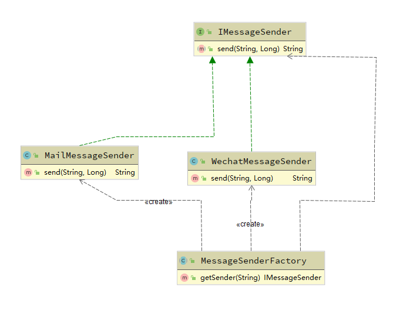

## 前言   
GOF23种设计模式可以按照用途分为三大类, 分别为创建型模式、结构型模式和行为型模式。创建型模式主顾名思义就是用于创建各种对象使用的模式，除了上篇说到的单例模式，还有工厂模式、抽象工厂模式、建造者模式、原型模式。这次对工厂模式再温习一次。
<!--more-->
## 工厂模式介绍  
工厂模式（Factory Pattern）是GOF23种设计模式中的创建型模式中的一种,也是最简单的模式之一。它提供了一种创建对象的方法，在客户端调用时不会暴露创建逻辑，并且使用一个统一接口来返回创建对象。  
## 场景
一般系统中会有许多消息推送的场景, 而消息的发送又有许多不同的渠道, 如果每次都是在发送消息时自己对发送渠道进行判断,实在是不够优雅, 而且在需要新增一个渠道时, 需要修改每个发送消息的代码. 所以在此场景就可以借由工厂模式来简化我们的代码. 

## 实现
### 统一的接口
工厂模式一般使用一个统一的接口来返回对象, 在我们推送消息的场景中, 我们可以定义一个消息发送器接口.  
```java
public interface IMessageSender {
    /**
     * send message and return send history id.
     *
     * @param message the message will be sent
     * @param userId  target user id
     * @return message history id
     */
    String send(String message, Long userId);
}
```  
### 几个不同的实现
有了统一的消息发送器接口后, 可以根据实际场景实现几个不同的消息发送器. 比如邮件发送器和微信消息发送器.  
1. 邮件发送器:  
    ```java
    import java.util.UUID;

    public class MailMessageSender implements IMessageSender {

        public String send(String message, Long userId) {
            //send a message to user of id[userId] by email
            return UUID.randomUUID().toString();
        }
    }
    ```  

2. 微信消息发送器:
    ```java
    import java.util.UUID;

    public class WechatMessageSender implements IMessageSender {

        public String send(String message, Long userId) {
            //send a message to user of id[userId] by wechat
            return UUID.randomUUID().toString();
        }
    }
    ```  

### 消息发送器工厂
有了统一接口和几个不同实现类之后, 需要一个工厂来完成对象的创建, 并提供一个方法来获取对象.
```java
public class MessageSenderFactory {
    public static final String TYPE_MAIL = "mail";
    public static final String TYPE_WECHAT = "wechat";

    /**
     * get a announced type of IMessageSender object
     *
     * @param messageType type of IMessageSender you want
     * @return a announced type of IMessageSender object
     */
    public IMessageSender getSender(String messageType) {
        switch (messageType) {
            case TYPE_MAIL:
//                create a new object or get a object from Context
                return new MailMessageSender();
            case TYPE_WECHAT:
                return new WechatMessageSender();
            default:
//                throw an exception or return a null object
//                return null;
                throw new NotImplementedException();
        }
    }
}
```  
### 调用
调用的部分很简单, 获取工厂对象之后, 直接使用工厂的接口来获取消息发送器  
```java
public class BussinessService {
    public void doBuss(MessageDTO messageDTO) {
//        do something
        MessageSenderFactory factory = new MessageSenderFactory();
        IMessageSender sender = factory.getSender(messageDTO.getMessageType());
        sender.send(messageDTO.getMessage(), messageDTO.getUserId());
    }

    class MessageDTO{
        private String message;
        private Long userId;
        private String messageType;

        // getter and setter ...
    }
}
```  
## 总结
从消息推送这个场景来看, 使用工厂模式在业务逻辑需要发送消息时, 调用的逻辑非常简单, 而且对业务逻辑隐藏了对象的创建过程. 而且现有的代码是只有邮件和微信两个渠道, 以后若是需要再添加一个站内信或者钉钉推送, 也只需要修改工厂类即可, 对业务逻辑部分没有改动或者很少改动, 符合开闭原则, 也极大的提高了程序的可维护性和可拓展性.  
> 另外示例代码比较简单, 实际代码中可借助Spring等框架简化对象的创建操作改进工厂类的实现逻辑, 甚至可以做到新增推送渠道连工厂类都不需要修改的程度.