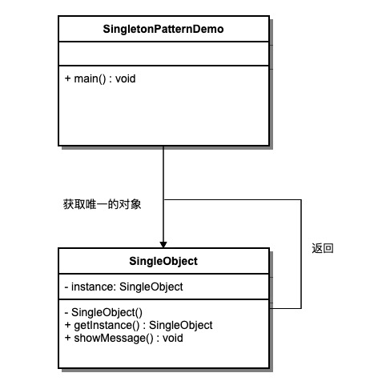

## 前言  
最近觉得自己基础虚浮, 准备重新学习基础知识, 设计模式中的单例模式又是非常常用的模式, 所以先从单例模式开始.   
<!--more-->
## 单例模式介绍
单例模式（Singleton Pattern）是GOF23种设计模式中的创建型模式中的一种, 也是最简单的模式之一。它提供了一种创建对象的方法，同时保证有且仅有一个该对象被创建，并提供获取该对唯一对象的入口。  

## 实现
由于使用场景很多，单例模式也有多种不同的实现，常见的有6种：
### 懒汉式  
懒汉式的实现最为简单，且只有在对象被使用到时才会进行对象的创建，所以被称为懒汉式。
```java
public class SingleObject{
    private static singleObject;

    private Singleton (){}

    public static SingleObject getInstance(){
        if(singleObject == null){
            singleObject = new SingleObject();
        }
        return singleObject;
    }
    //...
}
```  
从上面的代码可以看出，懒汉式的实现十分简单， 但缺点也十分明显，就是存在线程不安全的问题。当多个线程并发调用`getInstance()`方法时，SingleObject可能会被创建多次。 所以为了改进， 又有一种线程安全的懒汉式实现  
### 懒汉式（线程安全）
鉴于普通懒汉式线程安全问题，很容易想到使用锁来解决问题。于是便有下面的代码  
```java
public class SingleObject{
    private static singleObject;

    private Singleton (){}

    public static synchronized SingleObject getInstance(){
        if(singleObject == null){
            singleObject = new SingleObject();
        }
        return singleObject;
    }
    //...
}
```  
仅仅在方法上添加了一个`synchronized`关键字，让整个方法进入时需要获取对象锁。该方法的优势在于锁简单，但在高并发情况过重的锁会引起性能问题。所以再次基础上又有一种改进的方法。  

### 懒汉式（双重检查）
过重的锁在并发誓有性能问题，所以可以考虑缩小锁的范围。  
```java
public class SingleObject{
    private volatile static singleObject;

    private Singleton (){}

    public static SingleObject getInstance(){
        if(singleObject == null){
            synchronized(SingleObject.class){
                if(singleObject == null){
                     singleObject = new SingleObject();
                }
            }
        }
        return singleObject;
    }
    //...
}  
```  
之所以要对`singleObject`两次判空操作，是为了防止在获取到锁之前， 别的线程已经完成了该对象的初始化， 防止重复创建。同事还需要对`singleObject`对象加上`volatile`修饰符，是为了保证该对象在内存重的可见性，防止编译重排导致逻辑不正确。  

### 静态内部类
双重检查这种方式既保障了对象只能创建一次，又保障了在并发时的性能，是一种非常好用的方式。 另外也可以通过静态内部类的特性来实现双重检查一样的效果。   
```java
public class Singleton {  
    private static class ObjectHolder {  
        private static final Singleton INSTANCE = new Singleton();  
    }  
    private Singleton (){}  
    public static final Singleton getInstance() {  
        return ObjectHolder.INSTANCE;  
    }  
}
```  

### 枚举
枚举也是能够实现单例的途径之一，但是目前看到出现的频率比较低。 枚举也能只能序列化，也能保证对象只创建一次，而且写法简单的同时还保证了线程安全。  
```java  
public enum Singleton {  

    INSTANCE;

    public void doSomething() {  
    }  
}
```