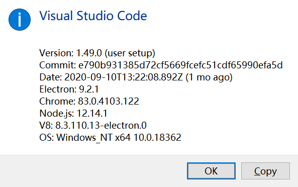
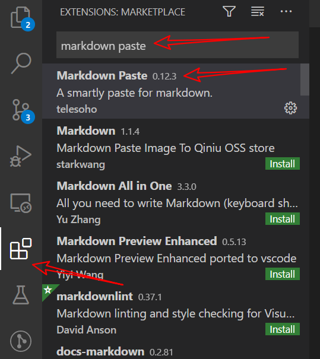
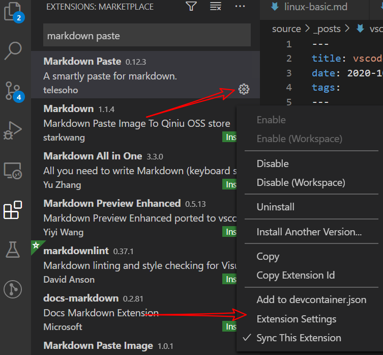
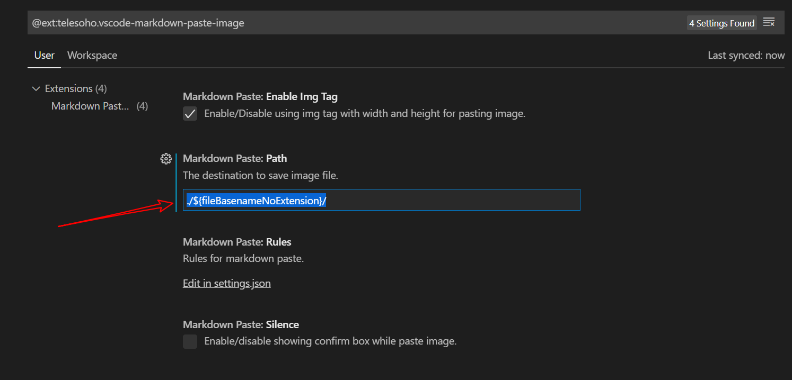
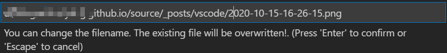

最近开始回归github pages, 重新捡起VS CODE来写记录了. 工欲善其事必先利其器, 以前每次使用markdown的时候最麻烦的就是从剪贴板贴图,所以今天先对vscode进行配置, 使得vscode能够自动从剪贴板中保存图片到本地目录, 且自动生成markdown图片链接.  
<!--more-->

### 准备
首先需要安装vscode, 版本的话应该没有限制.我这边使用的是1.49.0版本.  
  
安装完成之后可以按照自己的使用习惯修改样式.  

### 安装贴图插件  
在左侧的拓展tab中搜索`Markdown Paste`, 安装第一个即可. 安装完成之后默认就可以通过`ctrl + alt + v`进行粘贴图片. 需要注意的是只支持markdown文件, 其他文件类型不生效.  
  

### 配置自动保存路径  
由于我使用的是hexo, 文章中使用的图片需要在文件的同名目录下,为了方便我就直接修改默认保存路径为`当前文件不带后缀`的文件夹下  
1. 在左侧的拓展tab页中要找刚才安装好的`Markdown Paste`插件, 点击左下角的配置按钮,选择extension settings.  
      
2. 配置Markdown Past:Path, 设置值为`./${fileBasenameNoExtension}/`,意为当前文件不带后缀的文件夹下  
      

### 测试  
使用任意工具截图后保存到剪贴板中, 在vs code中编辑markdown文件时使用`ctrl + alt + v`,顶部将会弹出文件保存框, 默认会使用当前时间作为文件名,可以任意修改.  
